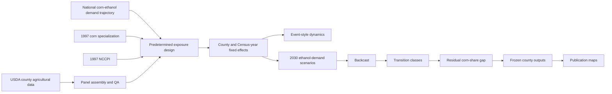

# E-SEAT

## Ethanol Spatial Exposure and Agricultural Transition framework

**E-SEAT** is a reproducible county-level empirical framework for studying how U.S. corn-ethanol demand has interacted with pre-existing agricultural and agroecological conditions across the Corn Belt, and whether the estimated differential demand component is large enough to move specialized counties toward lower corn shares when demand weakens.

The framework accompanies the *Ecological Economics* manuscript:

> **Fuel-Market Reform and Structural Land-Use Lock-in in the U.S. Corn Belt**  
> Manuscript: ECOLEC-D-26-03083

E-SEAT links data assembly, quality assurance, county-panel construction, the national ethanol-demand trajectory, predetermined exposure variables, fixed-effects estimation, event-style dynamics, scenario analysis, backcasting, transition classification, residual-gap analysis, and publication cartography in one auditable workflow.

## Research question

> **If corn-ethanol demand weakens, how much adjustment is associated with the estimated differential ethanol-demand channel, and where does county corn specialization remain above a diagnostic diversification threshold after that component is removed?**

The framework distinguishes **market responsiveness** from **transition feasibility**. A county can respond strongly to the national ethanol-demand path and still remain above the diversification benchmark because its starting corn share is high. A county with a smaller response can reach the benchmark if it begins closer to it.

This distinction is the central analytical idea behind E-SEAT.

## Study coverage

The analytical data spine contains **1,048 counties** across twelve Midwestern states:

Illinois, Indiana, Iowa, Kansas, Michigan, Minnesota, Missouri, Nebraska, North Dakota, Ohio, South Dakota, and Wisconsin.

The panel covers six Census of Agriculture waves:

**1997, 2002, 2007, 2012, 2017, and 2022**

which gives:

- **1,048 counties**
- **6 Census waves**
- **6,288 county-year rows**

The corrected Revision 1 backcast uses **990 eligible counties** with the observed 2022 corn-share and predetermined baseline information required for the transition analysis. The full 1,048-county panel remains the empirical data spine.

## E-SEAT architecture



E-SEAT refers to this **complete empirical architecture**, rather than to a single regression equation, exposure index, or backcast.

## Empirical design

### 1. County outcomes

The primary land-use outcome is county corn specialization:

$$
CornShare_{ct}=100\times\frac{CornHarvested_{ct}}{AgriculturalLand_{ct}}
$$

The framework also constructs crop intensity and the economic outcomes used in the paper, including land value, government payments per acre, and annual return.

### 2. National ethanol-demand trajectory

The national ethanol-demand measure is:

$$
E_t=100\times\frac{CornUsedForEthanol_t}{TotalCornProduction_t}
$$

Because this national series is common to every county within a Census year, its direct level is absorbed by Census-year fixed effects. E-SEAT identifies how county outcomes vary **differentially** along the national path according to predetermined county characteristics.

### 3. Predetermined exposure conditions

Two county characteristics are fixed at the beginning of the panel:

- **1997 corn specialization** (`BaseCorn`)
- **1997 National Commodity Crop Productivity Index** (`BaseNCCPI`)

They represent the two principal exposure gradients used in the main specification: historical agricultural specialization and baseline soil productivity.

### 4. Fixed-effects specification

For outcome $Y_{ct}$, the principal specification is:

$$
Y_{ct}=\alpha_c+\lambda_t+\beta_B(BaseCorn_c\times E_t)+\beta_N(BaseNCCPI_c\times E_t)+\delta PopDen_{ct}+\varepsilon_{ct}
$$

where $\alpha_c$ denotes county fixed effects and $\lambda_t$ denotes Census-year fixed effects. Standard errors are clustered by county in the principal estimates.

The county-specific estimated differential response is:

$$
m_c=\hat\beta_B BaseCorn_c+\hat\beta_N BaseNCCPI_c
$$

This estimated sensitivity connects the historical fixed-effects analysis to the scenario and backcasting stages.

## From responsiveness to transition feasibility

E-SEAT evaluates the transition question in two steps.

First, the framework estimates how county corn specialization responds differentially along the national ethanol-demand path. Second, the estimated county sensitivity is translated into alternative demand paths and compared with each county's distance from a corn-share benchmark.

For a scenario change $\Delta E_s$:

$$
\Delta CornShare_{cs}=m_c\Delta E_s
$$

and the implied county corn share is:

$$
\widehat{CornShare}_{cs}=\max\left(0, CornShare_{c,2022}+m_c\Delta E_s\right)
$$

The main diagnostic threshold is a corn share of **20% or less of agricultural land**. Threshold sensitivity is evaluated at **15%, 25%, and 30%**.

## Backcast

The E-SEAT backcast progressively removes the **estimated differential ethanol-demand component** from observed 2022 county corn shares.

The common national ethanol component is absorbed by Census-year fixed effects. The transition exercise therefore carries forward the differential component generated by the interaction of the national ethanol-demand path with the predetermined county exposure conditions.

The backcast asks whether that estimated adjustment is sufficient to move each eligible county to the selected corn-share threshold.

## Transition classification

For the 20% diagnostic threshold, eligible counties are classified according to the demand reduction required to reach the benchmark:

| Class | Transition status |
| --- | --- |
| 1 | Already at or below the threshold |
| 2 | Crosses the threshold under a 25% ethanol-demand decline |
| 3 | Crosses the threshold under a 50% ethanol-demand decline |
| 4 | Crosses only under full removal of the estimated differential channel |
| 5 | Remains above the threshold after full differential-channel removal |

The frozen corrected Revision 1 pipeline checks the following class counts:

| Class | Counties |
| ---: | ---: |
| 1 | 439 |
| 2 | 14 |
| 3 | 17 |
| 4 | 37 |
| 5 | 483 |
| **Total eligible** | **990** |

These counts are hard replication checkpoints in the final analytical and cartographic workflow.

## Residual specialization gap

For counties remaining above the threshold after differential-channel removal, E-SEAT calculates the remaining distance from the benchmark:

$$
ResidualGap_c=\max\left(0,\widehat{CornShare}_{c,full}-T\right)
$$

where $T$ is the selected diagnostic corn-share threshold.

The residual gap identifies the additional reduction in county corn specialization required beyond the adjustment associated with the estimated differential ethanol-demand component.

## Dynamic and robustness analysis

E-SEAT reproduces the analyses used to assess the historical pattern and the stability of the transition result, including:

- event-style differential dynamics using predetermined exposure;
- sample-exclusion checks for influential baseline corn and NCCPI observations;
- ethanol-plant count and presence robustness specifications;
- county- and state-clustered inference;
- leave-one-state-out estimation;
- alternative diversification thresholds;
- asymmetric reversibility tests; and
- state-level scenario and transition summaries.

The event-style component describes the timing of exposure-related divergence across Census waves. The fixed-effects exposure specification provides the historical differential-response estimates carried into the scenario and backcasting stages.

## Data sources and project inputs

The final Revision 1 master pipeline uses the following project inputs:

| File | Role in E-SEAT |
| --- | --- |
| `AgDBase.dta` | County agricultural panel and analytical data spine |
| `CensusofAgData.dta` | Source Census fields used to restore original missingness |
| `ohio_2022_corn_govpayment_corrections.dta` | Documented Ohio 2022 corn-acreage and government-payment correction |
| `EthanolPlantsatCounties.dta` | County ethanol-plant information for descriptive and robustness analysis |
| `CornQP.dta` | National corn production and ethanol-use series |
| `CornPC.dta` | County corn input used in descriptive exposure construction |
| `ext_margin.dta` | Extensive-margin indicator used in descriptive exposure construction |
| `cb_2023_midwest_counties_500k.zip` | 2023 Census Cartographic Boundary county geometry for the twelve study states |

The empirical data architecture draws principally on the **USDA Census of Agriculture**, USDA national corn-use series, USDA NRCS **NCCPI**, county ethanol-plant information, population data, and official U.S. Census cartographic boundary geometry.

Detailed provenance and redistribution information is maintained in [`data/README.md`](data/README.md) and [`spatial/README.md`](spatial/README.md).

## Data correction and quality assurance

Revision 1 treats data provenance and QA as part of the reproducible framework.

The final pipeline:

- restores raw Census missingness before rebuilding analytical variables;
- applies the documented official Ohio 2022 correction;
- retains suppressed or unavailable harvested-corn observations as missing;
- rebuilds corn share from harvested corn acreage and agricultural land;
- checks county-year uniqueness and panel structure;
- checks analytical-input merges and spatial joins;
- applies an explicit backcast-eligibility flag; and
- stops when a hard replication check fails.

Frozen integrity checks include:

- **1,048 counties × 6 waves = 6,288 county-year rows**
- Ohio 2022 observed county corn acreage = **3,313,863 acres**
- Ohio 2022 suppressed corn-acreage counties = **2**
- Ohio 2022 county government payments = **$136,764,000**
- Census cartographic boundary counties = **1,055**
- matched analytical counties = **1,048**
- backcast-eligible counties = **990**
- transition classes = **439 / 14 / 17 / 37 / 483**

## Analytical implementation

### Stata

**Stata is the authoritative analytical pipeline.**

The final master file is:

```text
FINAL_ECOLEC_R1_MASTER.do
```

It performs:

- data reconstruction and correction;
- quality assurance;
- variable construction;
- descriptive exposure construction;
- fixed-effects estimation;
- event-style analysis;
- 2030 scenario translation;
- backcasting;
- threshold classification;
- residual-gap analysis;
- robustness and sensitivity checks;
- table and analytical-figure generation; and
- frozen county-level exports for publication mapping.

A successful run completes with:

```text
R1 REVISION PIPELINE COMPLETE
```

### Python

The publication cartography companion is:

```text
FINAL_ECOLEC_R1_PUBLICATION_MAPS.py
```

It reads frozen Stata county outputs, joins them to the 2023 Census Cartographic Boundary county geometry by FIPS/GEOID, verifies the expected analytical sample and transition-class counts, and renders the publication maps.

## Publication outputs

The workflow generates the analytical outputs used to construct the paper, including:

- fixed-effects regression tables;
- event-style dynamics;
- exposure-index diagnostics;
- 2030 scenario summaries;
- policy-sufficiency analysis;
- backcast feasibility summaries;
- threshold sensitivity;
- transition-group profiles;
- residual-gap summaries;
- asymmetric reversibility results;
- frozen county-level analytical files; and
- publication maps.

The principal publication maps are:

1. corn-ethanol transition exposure;
2. 2030 transition pressure;
3. county transition classification; and
4. residual corn-share gap after differential-channel removal.

## Repository structure

```text
E-SEAT/
├── README.md
├── LICENSE
├── .gitignore
│
├── code/
│   ├── stata/
│   └── python/
│
├── data/
│   └── README.md
│
├── spatial/
│   └── README.md
│
├── outputs/
│   ├── tables/
│   ├── figures/
│   ├── maps/
│   └── county_outputs/
│
├── qa/
│
└── documentation/
    └── E-SEAT_workflow.md
```

## Replication sequence

The public replication package will follow this execution order:

```text
1. Place the documented analytical inputs in their repository locations.
2. Run code/stata/FINAL_ECOLEC_R1_MASTER.do.
3. Confirm that Stata ends with "R1 REVISION PIPELINE COMPLETE".
4. Run code/python/FINAL_ECOLEC_R1_PUBLICATION_MAPS.py.
5. Compare generated QA checks, transition counts, tables, and maps with the frozen release outputs.
```

The repository versions of the final scripts use portable repository-relative paths while preserving the frozen empirical specification and numerical logic.

## Software

The analytical pipeline was developed in **StataNow 18.5** and uses:

- `ftools`
- `reghdfe`
- `estout`
- `spmap`
- `coefplot`
- `shp2dta`

Publication cartography uses Python with:

- `numpy`
- `pandas`
- `geopandas`
- `matplotlib`
- `shapely`
- `pyogrio`

Exact Python package versions will be frozen with the replication release.

## Citation

Until the associated article receives its final bibliographic record, please cite the repository and manuscript as:

> Ofori, E. K. (2026). **E-SEAT: Ethanol Spatial Exposure and Agricultural Transition framework**. Reproducible research code and data documentation accompanying *Fuel-Market Reform and Structural Land-Use Lock-in in the U.S. Corn Belt*.

A machine-readable `CITATION.cff` file will accompany the public release.

## Author

**Elvis Kwame Ofori**  
Plant and AgriBiosciences Research Centre (PABC), Ryan Institute  
University of Galway, Galway, Ireland

## License

Repository code is released under the **MIT License**. Source datasets and spatial files retain the terms and attribution requirements of their original providers.