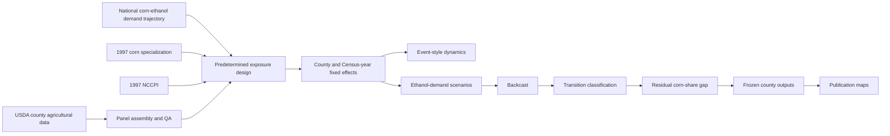

# E-SEAT

## Ethanol Spatial Exposure and Agricultural Transition framework

**E-SEAT** is a reproducible county-level empirical framework for analysing how U.S. corn-ethanol demand interacted with pre-existing agricultural structure and agroecological suitability across the Corn Belt, and how far the estimated demand-linked adjustment can move specialized counties toward lower corn shares when ethanol demand weakens.

The framework accompanies the *Ecological Economics* manuscript:

> **Fuel-Market Reform and Structural Land-Use Lock-in in the U.S. Corn Belt**  
> Manuscript: ECOLEC-D-26-03083

E-SEAT integrates county data assembly and quality assurance, national ethanol-demand construction, predetermined exposure measures, fixed-effects estimation, event-style dynamics, demand scenarios, backcasting, transition classification, residual-gap analysis, robustness testing, frozen county outputs, and publication cartography in one reproducible workflow.

## Research question

> **If corn-ethanol demand weakens, how much adjustment is associated with the estimated differential ethanol-demand channel, and where does corn specialization remain above a diagnostic diversification threshold after that adjustment?**

The framework separates two empirical questions that are often treated as equivalent:

1. **Market responsiveness:** how county outcomes vary along the national ethanol-demand path according to pre-existing agricultural and biophysical conditions.
2. **Transition feasibility:** whether the estimated adjustment is large enough to close each county's distance from a diversification benchmark.

This distinction provides the organising logic for the historical estimation, scenario analysis, and backcast.

## Study coverage

E-SEAT uses a balanced county panel covering twelve Midwestern states:

**Illinois, Indiana, Iowa, Kansas, Michigan, Minnesota, Missouri, Nebraska, North Dakota, Ohio, South Dakota, and Wisconsin.**

The panel contains six Census of Agriculture waves:

**1997, 2002, 2007, 2012, 2017, and 2022.**

Current replication checkpoints:

| Check | Value |
| --- | ---: |
| Counties in analytical panel | 1,048 |
| Census waves | 6 |
| County-year observations | 6,288 |
| Backcast-eligible counties | 990 |
| Census cartographic counties | 1,055 |
| Analytical counties matched spatially | 1,048 |

## Framework architecture



**E-SEAT refers to this complete empirical architecture.** Individual components retain their standard technical names, including the fixed-effects specification, exposure measures, scenario analysis, and backcast.

## Empirical design

### County corn specialization

The principal land-use outcome is harvested corn area as a share of total agricultural land:

$$
CornShare_{ct}=100\times\frac{CornHarvested_{ct}}{AgriculturalLand_{ct}}
$$

The framework also constructs crop intensity and the economic outcomes used in the paper, including farmland value, government payments per acre, and annual return.

### National ethanol-demand trajectory

The national ethanol-demand measure is the share of U.S. corn production used for ethanol:

$$
E_t=100\times\frac{CornUsedForEthanol_t}{TotalCornProduction_t}
$$

### Predetermined exposure conditions

Two county characteristics are measured at the beginning of the panel and carried through the empirical design:

- **1997 corn specialization** (`BaseCorn`)
- **1997 National Commodity Crop Productivity Index** (`BaseNCCPI`)

These capture historical agricultural specialization and baseline soil productivity.

### Fixed-effects specification

For county $c$ and Census year $t$:

$$
Y_{ct}=\alpha_c+\lambda_t+\beta_B(BaseCorn_c\times E_t)+\beta_N(BaseNCCPI_c\times E_t)+\delta PopDen_{ct}+\varepsilon_{ct}
$$

where $\alpha_c$ denotes county fixed effects and $\lambda_t$ denotes Census-year fixed effects. Standard errors are clustered by county in the principal estimates.

The estimated county-specific differential response is:

$$
m_c=\hat\beta_B BaseCorn_c+\hat\beta_N BaseNCCPI_c
$$

This quantity connects the historical fixed-effects analysis to the scenario and backcasting stages.

## Scenario translation and backcast

For an ethanol-demand change $\Delta E_s$, the implied change in county corn share is:

$$
\Delta CornShare_{cs}=m_c\Delta E_s
$$

with simulated corn share:

$$
\widehat{CornShare}_{cs}=\max\left(0,CornShare_{c,2022}+m_c\Delta E_s\right)
$$

The principal diagnostic benchmark is a county corn share of **20% or less of agricultural land**. Sensitivity tests repeat the classification at **15%, 25%, and 30%**.

The E-SEAT backcast progressively removes the **estimated differential ethanol-demand component** from observed 2022 corn shares and compares the resulting county corn share with the selected benchmark.

## Transition classification

Eligible counties are classified by the demand reduction required to reach the 20% benchmark:

| Class | Transition status |
| --- | --- |
| 1 | Already at or below the benchmark |
| 2 | Reaches the benchmark under a 25% ethanol-demand decline |
| 3 | Reaches the benchmark under a 50% ethanol-demand decline |
| 4 | Reaches the benchmark only under full differential-channel removal |
| 5 | Remains above the benchmark after full differential-channel removal |

Current frozen replication counts:

| Class | Counties |
| ---: | ---: |
| 1 | 439 |
| 2 | 14 |
| 3 | 17 |
| 4 | 37 |
| 5 | 483 |
| **Total eligible** | **990** |

These counts are embedded as hard integrity checks in the analytical and cartographic workflow.

## Residual specialization gap

For counties that remain above the selected benchmark, E-SEAT calculates the remaining corn-share distance:

$$
ResidualGap_c=\max\left(0,\widehat{CornShare}_{c,full}-T\right)
$$

where $T$ is the diagnostic corn-share threshold.

The residual gap measures how much additional corn-share adjustment is required beyond the adjustment associated with the estimated differential ethanol-demand component.

## Dynamic analysis and robustness

The replication workflow includes:

- event-style differential dynamics using predetermined exposure;
- influential-observation exclusions for baseline corn specialization and NCCPI;
- ethanol-plant count and plant-presence robustness specifications;
- county-clustered and state-clustered inference;
- leave-one-state-out estimation;
- alternative diversification benchmarks;
- asymmetric reversibility tests; and
- state-level scenario and transition summaries.

## Data architecture

The current master pipeline uses the following project inputs:

| File | Role in E-SEAT |
| --- | --- |
| `AgDBase.dta` | County agricultural panel and analytical data spine |
| `CensusofAgData.dta` | Census fields used to restore source missingness |
| `ohio_2022_corn_govpayment_corrections.dta` | Ohio 2022 corn-acreage and government-payment correction |
| `EthanolPlantsatCounties.dta` | County ethanol-plant information for descriptive and robustness analysis |
| `CornQP.dta` | National corn production and ethanol-use series |
| `CornPC.dta` | County corn input used in descriptive exposure construction |
| `ext_margin.dta` | Extensive-margin indicator used in descriptive exposure construction |
| `cb_2023_midwest_counties_500k.zip` | 2023 Census Cartographic Boundary county geometry |

The empirical data architecture draws principally on the **USDA Census of Agriculture**, USDA national corn-use series, USDA NRCS **NCCPI**, county ethanol-plant information, population data, and official U.S. Census cartographic boundary geometry.

Data provenance, preparation, and redistribution status are documented in [`data/README.md`](data/README.md) and [`spatial/README.md`](spatial/README.md).

## Quality assurance

Reproducibility checks are embedded directly in the E-SEAT workflow. The current frozen checks include:

| QA checkpoint | Expected value |
| --- | ---: |
| County-year panel | 6,288 rows |
| Ohio 2022 observed county corn acreage | 3,313,863 acres |
| Ohio 2022 suppressed corn-acreage counties | 2 |
| Ohio 2022 county government payments | $136,764,000 |
| Census cartographic counties | 1,055 |
| Spatially matched analytical counties | 1,048 |
| Backcast-eligible counties | 990 |
| Transition classes | 439 / 14 / 17 / 37 / 483 |

The master run stops for inspection when a hard integrity check fails.

## Analytical implementation

### Stata

**Stata is the authoritative analytical pipeline.**

The master analysis file is:

```text
code/stata/FINAL_ECOLEC_R1_MASTER.do
```

It performs data reconstruction, QA, variable construction, descriptive exposure construction, fixed-effects estimation, event-style analysis, scenario translation, backcasting, transition classification, residual-gap analysis, robustness testing, table generation, analytical figures, and frozen county-level exports.

A successful run ends with:

```text
R1 REVISION PIPELINE COMPLETE
```

### Python

Publication cartography is produced from:

```text
code/python/FINAL_ECOLEC_R1_PUBLICATION_MAPS.py
```

The script reads frozen Stata county outputs, joins them to the 2023 Census Cartographic Boundary county geometry using FIPS/GEOID, verifies the expected analytical sample and transition classes, and renders the publication maps.

## Repository structure

```text
E-SEAT/
├── README.md
├── LICENSE
├── .gitignore
│
├── code/
│   ├── stata/
│   └── python/
│
├── data/
│   └── README.md
│
├── spatial/
│   └── README.md
│
├── outputs/
│   ├── tables/
│   ├── figures/
│   ├── maps/
│   └── county_outputs/
│
├── qa/
│
└── documentation/
    └── E-SEAT_workflow.md
```

## Replication

Once the documented inputs are in place, the replication sequence is:

```text
1. Run code/stata/FINAL_ECOLEC_R1_MASTER.do
2. Confirm "R1 REVISION PIPELINE COMPLETE"
3. Run code/python/FINAL_ECOLEC_R1_PUBLICATION_MAPS.py
4. Verify the QA checkpoints and frozen transition counts
5. Compare generated tables, figures, county outputs, and maps with the release outputs
```

The repository versions of the scripts use portable repository-relative paths while preserving the frozen empirical specification and numerical logic.

## Main outputs

E-SEAT reproduces the analytical materials used in the paper, including:

- fixed-effects regression tables;
- event-style dynamics;
- descriptive exposure diagnostics;
- ethanol-demand scenario summaries;
- backcast feasibility classifications;
- threshold sensitivity results;
- transition-group profiles;
- residual-gap summaries;
- asymmetric reversibility results;
- frozen county-level analytical files; and
- publication-quality maps.

The principal maps report:

1. corn-ethanol transition exposure;
2. 2030 transition pressure;
3. county transition classification; and
4. residual corn-share gap.

## Software

The analytical pipeline was developed in **StataNow 18.5** using:

- `ftools`
- `reghdfe`
- `estout`
- `spmap`
- `coefplot`
- `shp2dta`

Publication cartography uses Python with:

- `numpy`
- `pandas`
- `geopandas`
- `matplotlib`
- `shapely`
- `pyogrio`

Exact package versions will be recorded in the public replication release.

## Citation

Until the associated article receives its final bibliographic record, please cite the framework as:

> Ofori, E. K. (2026). **E-SEAT: Ethanol Spatial Exposure and Agricultural Transition framework**. Reproducible research code and data documentation accompanying *Fuel-Market Reform and Structural Land-Use Lock-in in the U.S. Corn Belt*.

A machine-readable `CITATION.cff` file will be included in the release package.

## Author

**Elvis Kwame Ofori**  
Plant and AgriBiosciences Research Centre (PABC), Ryan Institute  
University of Galway, Galway, Ireland

## License

Repository code is released under the **MIT License**. Source datasets and spatial files retain the terms and attribution requirements of their original providers.
